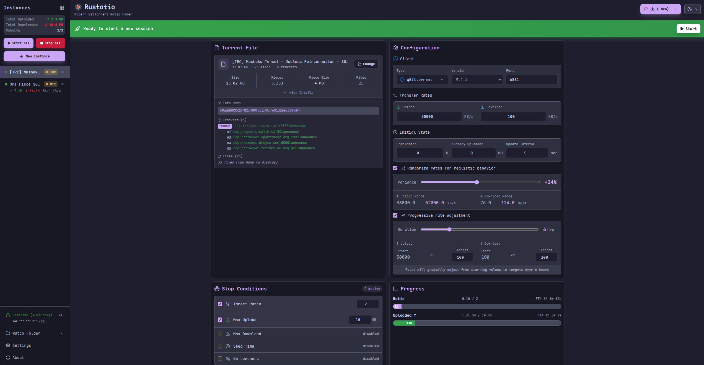

<div align="center">
  
</div>

# Rustatio 中文合并版

现代 BitTorrent 比率管理工具 —— 全中文界面,合并 [mRatio](https://www.sb-innovation.de) 逆向精华功能的 [Rustatio](https://github.com/takitsu21/rustatio)(MIT)分支。

通过模拟主流 BT 客户端(qBittorrent / uTorrent / Transmission / Deluge / BitTorrent)的 tracker 汇报行为,管理你的分享率:自定义上传/下载速率、做种或下载状态、代理、停止条件等。

> [!IMPORTANT]
> 本工具仅供学习交流。在私人 tracker 上伪造上传/下载数据可能违反站点服务条款并导致封号,使用风险自负。

## ✨ 功能特性

- **🇨🇳 全中文界面**:设置、预设、提示、错误消息全部中文化
- **🎭 客户端伪装**:支持 qBittorrent / uTorrent / Transmission / Deluge / BitTorrent,版本可自选
- **📁 mRatioClients 伪装档案**:自动加载 `mRatioClients/*.mRClient`(精确复刻各客户端 peer_id / key 结构)
- **📜 历史记录导入**:自动读取 `mRatioTorrents/*.mRSave`,打开软件即可恢复以前的种子实例
- **🌐 代理设置**:SOCKS5 / HTTP,支持用户名密码,一键测试代理(显示出口 IP),可应用到单个实例或全部实例,状态一目了然
- **🌱 做种 / 下载切换**:种子卡片上一键切换"做种(完整 100%)"或"下载中(可设完成度)"
- **🔗 网站直达**:自动从 tracker 推导种子所属网站,点击即在浏览器打开登录
- **📡 运行状态反馈**:运行中实时显示"汇报正常 · 第 N 次 · 做种 S / 下载 L",正常与否一眼可见
- **💾 自动保存**:所有设置修改即改即存,下次打开软件完整还原(界面提示"已自动保存")
- **🧹 批量管理**:网格视图多选批量操作、批量导入、一键清理空白实例
- **👁 监视文件夹**:放入 .torrent 自动创建实例、可自动开始
- **🎲 逼真行为**:速率随机化、渐进速率、随机分享率、空闲检测(无下载者/做种者时 idle)
- **🛑 丰富停止条件**:目标比率 / 最大上传 / 最大下载 / 做种时长,支持停止后动作
- **📝 调试日志**:记录所有功能使用与错误,方便排查(见下方"常见问题")

## 📥 下载安装

前往 [Releases](https://github.com/zhengwuji/bt-Ratio-Faker/releases) 页面,下载最新版:

- `Rustatio-vX.Y-win64.exe` —— Windows 64 位,单文件免安装,双击即用

每个版本附带中文更新说明。标题栏显示版本号(如 `Rustatio v11`),方便确认是否新版。

## 🚀 快速上手

1. **选择种子**:点击「种子文件」卡片的【更换】或拖入 `.torrent` 文件
2. **选择状态**:在「运行状态」卡选择【做种】(种子已下完,纯做种)或【下载中】(可设完成度)
3. **配置代理(可选)**:「代理设置」填协议/地址/端口(如 SOCKS5 / 127.0.0.1 / 11111)→【测试代理】验证 →【应用到当前实例】
4. **设置速率**:「传输速率」填上传/下载速率(KB/s),建议开启随机化并避免整数速率
5. **开始**:点右上角绿色▶开始按钮,状态条出现「汇报正常」即表示正常工作
6. **停止条件(可选)**:设置目标比率 / 最大上传等,达到后自动停止

### 常见问题

- **提示"Tracker 拒绝了当前端口(已列入黑名单)"**:把实例「端口」从 6881 改成高位端口(如 51413),重新开始
- **提示"Tracker 不可用,N 秒后重试"**:网络不通或 tracker 暂时故障;如使用代理,确认代理可用并已应用到该实例
- **查日志**:`%APPDATA%\rustatio\rustatio-debug.log`(每个功能使用与报错都有记录)

## 🔨 从源码构建

环境要求:Rust(stable)+ Node.js 20 + wasm-pack

```bash
# 1. 构建 WASM 模块
cd rustatio-wasm
wasm-pack build --target web --out-dir ../ui/src/lib/wasm --release

# 2. 构建前端
cd ../ui
npm ci
npx vite build

# 3. 编译桌面程序(产物在 target/release/rustatio-desktop.exe)
cd ..
cargo build --release -p rustatio
```

Windows 下也可直接运行 `scripts/重新编译.bat` 一键完成。

### 自动编译(CI)

- 推送代码到 `main` 分支(修改 README.md 除外)会自动触发 GitHub Actions 编译 Windows 版,可在 Actions 页面下载产物
- 推送 `v*` 标签会自动编译并创建 Release,附上中文更新说明:

```bash
git tag -a v12 -m "中文更新内容写在这里"
git push origin v12
```

## 📋 更新日志

| 版本 | 主要更新 |
| --- | --- |
| v11 | 删除跳转原作者仓库的链接;新增"可视化保存"(设置改动自动保存并显示已保存提示) |
| v10 | 运行中新增「汇报正常」实时反馈;修复代理输入框被清空的问题 |
| v9 | Tracker 拒绝原因透传(端口黑名单等直接显示中文提示);默认端口改为 51413(不易被拉黑) |
| v8 | 种子卡片新增「做种 / 下载中」一键切换 |
| v7 | 初始状态新增「状态模式」;进度卡做种模式绿色满进度显示 |
| v6 | 修复 scrape 误判导致"Tracker 不可用";代理卡片新增应用到当前实例 / 取消代理 / 状态显示 |
| v5 | 种子所属网站移到卡片下方醒目横幅,整块可点击 |
| v4 | 种子文件卡片显示所属网站并可一键打开登录 |
| v3 | 界面英文清零(预设卡片/检测提示/网格视图/全部弹窗) |
| v2 | 代理「应用到全部实例」;版本号 vN 递增标识 |
| v1 | 首个中文合并版:mRatioClients 档案、历史记录导入、清理空白实例、调试日志、代理测试、移除更新提示 |

## 🙏 致谢

- [takitsu21/Rustatio](https://github.com/takitsu21/rustatio) —— 上游项目(MIT License)
- [mRatio](https://www.sb-innovation.de) —— 伪装档案与正则模板功能来源
- 基于 [Tauri](https://tauri.app/)、[Svelte 5](https://svelte.dev/)、[Tailwind CSS](https://tailwindcss.com/) 构建

## 📄 许可证

本项目基于 [MIT License](LICENSE) 开源。

---

<div align="center">
  
  &nbsp;
  
</div>
